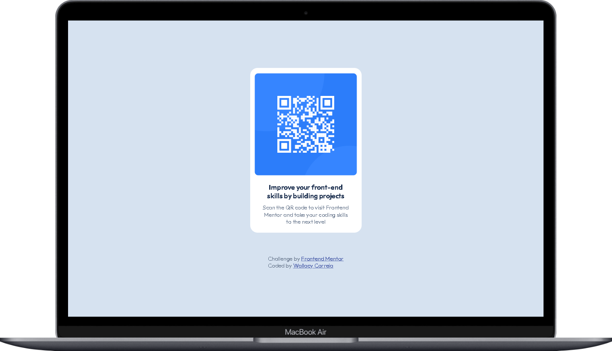
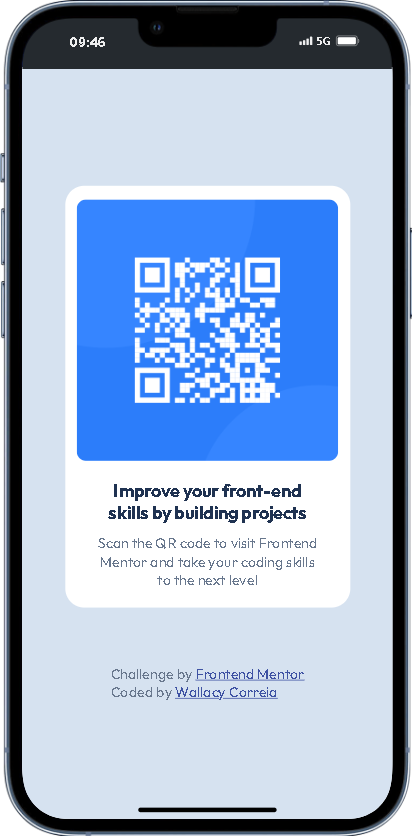

# Solução do componente QR code no Frontend Mentor

Esta é uma solução para o [desafio do componente QR code no Frontend Mentor](https://www.frontendmentor.io/challenges/qr-code-component-iux_sIO_H). Os desafios do Frontend Mentor ajudam você a melhorar suas habilidades de codificação construindo projetos realistas.

## Índice

- [Visão Geral](#visão-geral)
  - [Captura de Tela](#captura-de-tela)
  - [Links](#links)
- [Meu Processo](#meu-processo)
  - [Construído com](#construído-com)
  - [O que eu aprendi](#o-que-eu-aprendi)
  - [Desenvolvimento contínuo](#desenvolvimento-contínuo)
  - [Recursos úteis](#recursos-úteis)
- [Autor](#autor)

## Visão Geral

### Captura de Tela

### Links

- URL da Solução: [Adicione o URL da solução aqui](https://github.com/WallacyDev/Componente-de-c-digo-QR.git)
- URL do Site ao Vivo: [Adicione o URL do site ao vivo aqui](https://github.com/WallacyDev/Componente-de-c-digo-QR.git)

## Meu Processo

### Construído com

- Marcação HTML5 semântica
- Propriedades personalizadas CSS
- Flexbox
- Fluxo de trabalho mobile-first

### O que eu aprendi

  <main class="card">
    

      
    

    

      <h3 class="titulo">Improve your front-end skills by building projects</h3>
      
Scan the QR code to visit Frontend Mentor and take your coding skills to the next level

    

  </main>

.qrcode {
display: flex;
width: 275px;
height: 275px;
border-radius: 10px;
margin-top: 15px;
}

### Desenvolvimento contínuo

- Proximo passo aprender javascript

### Recursos úteis

- [Recurso exemplo 1](https://htmlreference.io/lists/) - esse site tem me ajudado muito e quero aqui recomendar para aperfeiçoar o HTML de quem tambem esta iniciando.

- [Recurso exemplo 2](https://htmlreference.io/lists/) - esse site tem me ajudado muito e quero aqui recomendar para aperfeiçoar o CSS de quem tambem esta iniciando.

## Autor

- Website - [Wallacy Correia](https://www.your-site.com)
- Frontend Mentor - [@WallacyDev](https://www.frontendmentor.io/profile/WallacyDev)
